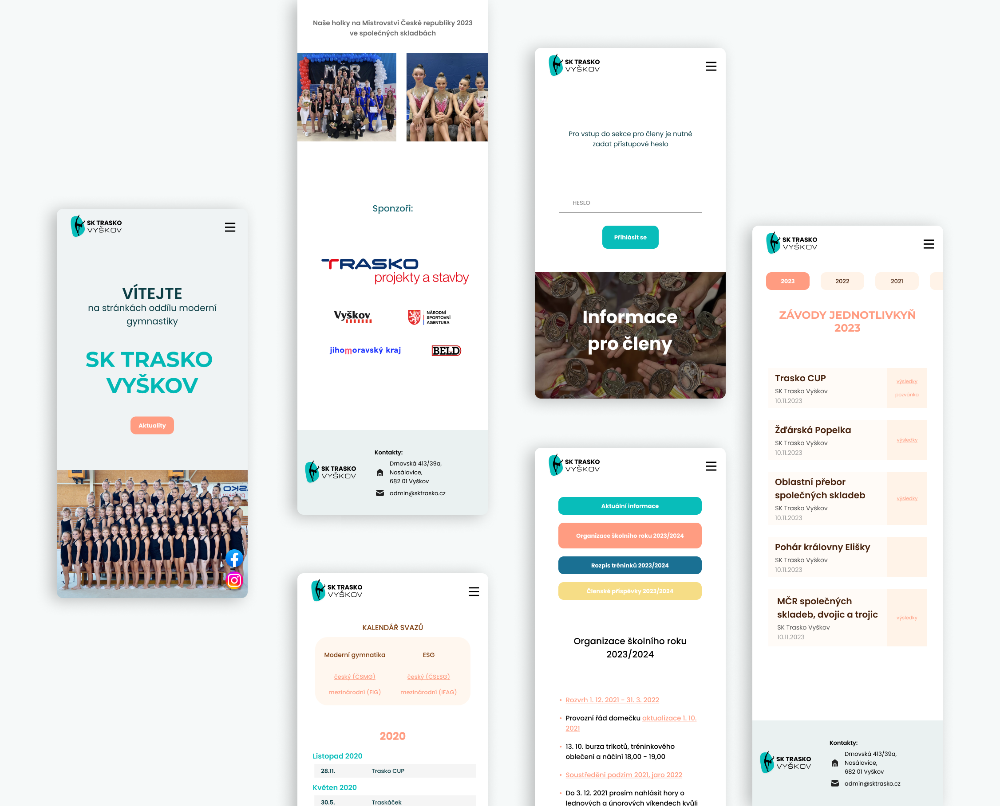
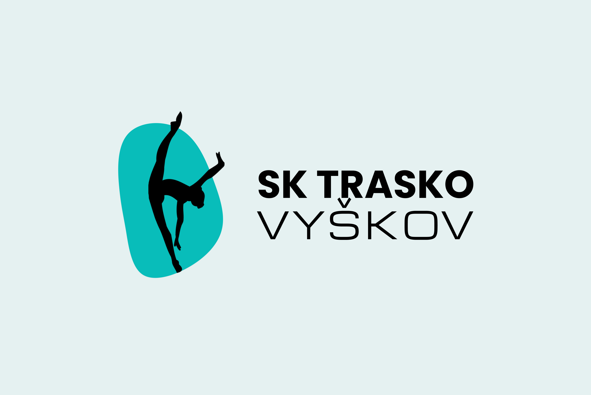
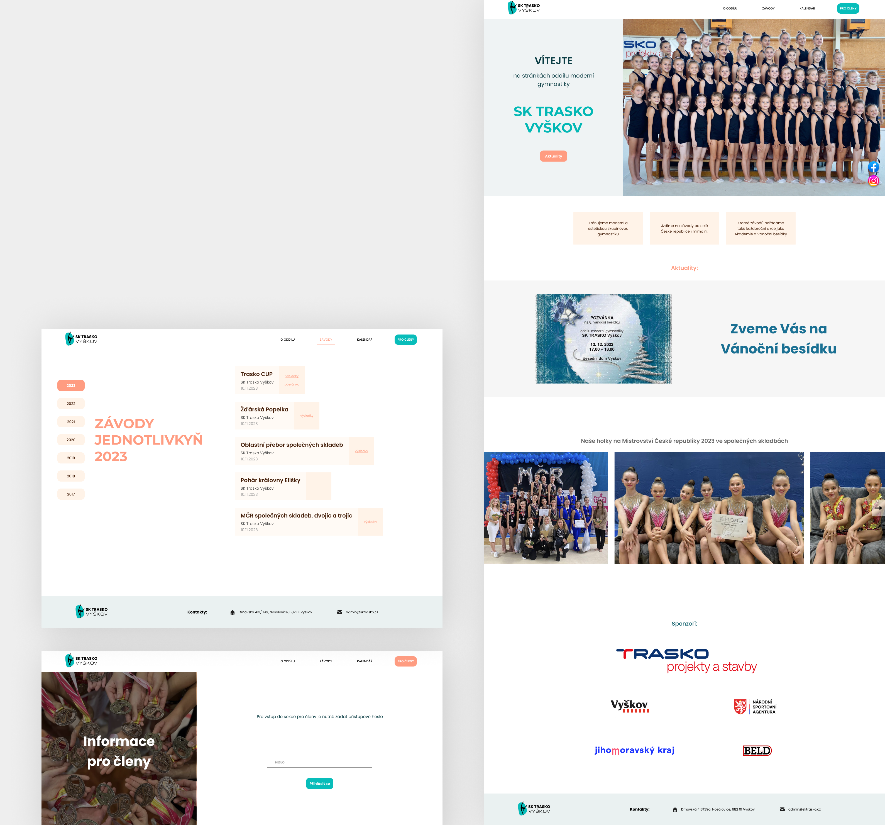

# SK TRASKO Vyškov
Web pro oddíl moderní gymnastiky SK TRASKO Vyškov.

Technologie: Vue.js 3 Composition API, Typescript, Tailwind

## Návrhy webu ve Figmě
Prototyp webu obsahuje návrhy pro desktopová i mobilní zařízení.

Odkaz: [Figma](https://www.figma.com/file/CQFsWhm8bDZLkdJ0MClBub/Sk-Trasko-Vy%C5%A1kov?type=design&node-id=0%3A1&mode=design&t=fDZXMS0PFdsedC3R-1)

## Ukázky návrhů








## Project setup
```
yarn install
```

### Compiles and hot-reloads for development
```
yarn serve
```
